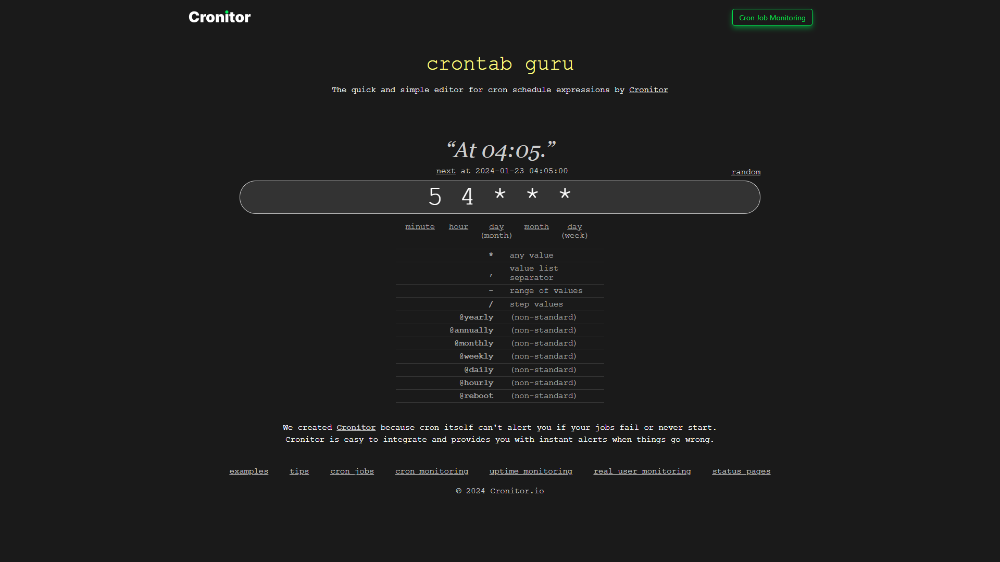

# UTC 502 - Principes fondamentaux des Systèmes d'exploitation

## Compile and run a C program
```sh
nano hello.c
```

```c
#include <stdio.h>

int main(void) {
	printf("Ia ora na Cnam.pf\n");
}
```

**Compile the C file into an executable program**
```sh
gcc -o hello hello.c
```

Then execute the compiled program
```sh
./hello
```

### Go further
Show hexadecimal format of the compiled code
```sh
hexdump hello
```

***
# Creating child processes

```c
#include <stdio.h>
#include <unistd.h>

int main(void) {

    pid_t pid = fork(); 

    if (pid > 0) {
        printf("Parent process\n");
    } else if (pid == 0) {
        printf("Child process\n");
    } else {
        fprintf(stderr, "Fork failed\n");
        return 1;
    }

    return 0;
}
```

compile then run

## 1.1 - show PIDs
```c
#include <stdio.h>
#include <unistd.h>
#include <stdlib.h>
#include <sys/wait.h>
#include <sys/types.h>

int main(void) {

    pid_t pid, fils, parent;
    int etat;

    parent = getpid();
    printf("Parent pid : %d\n", parent);

    pid = fork();

    if (pid < 0) {
        fprintf(stderr, "fork() failed ! \n");
    }
    
    if (pid == 0) {
        fils = getpid();
        printf("Enfant pid=%d\n", fils);
        sleep(3);
        //exit(0);
    }
    else
    {
        wait(&etat);
        printf("Parent : enfant terminé, renvoie %d\n", etat);
    }

    printf("Fin programme\n");

    return 0;
}
```

compile then run

## 1.2 - Concurrent processes
```c
#include <stdio.h>
#include <unistd.h>
#include <stdlib.h>
#include <sys/wait.h>
#include <sys/types.h>

int main(void) {

    pid_t pid, fils, parent;
    int etat;
    int i = 0;

    parent = getpid();
    printf("Parent pid : %d\n", parent);
    pid = fork();

    if (pid < 0) {
        fprintf(stderr, "fork() failed ! \n");
    }
    
    if (pid == 0) {
        fils = getpid();
        printf("Enfant pid=%d\n", fils);
        for(i = 0; i < 10; i++)
        {
            printf("Enfant i : %d\n", i);
            execlp();
            sleep(1);
        }
        printf("Enfant se termine\n");
        exit(0);
    }
    else
    {
        for(i = 0; i < 10; i++)
        {
            printf("Parent i : %d\n", i);
            sleep(2);
        }
        wait(&etat);
        printf("Parent : enfant terminé, renvoie %d\n", etat);
    }

    printf("Fin programme\n");

    return 0;
}
```

## 1.3 - Arrêt de processus enfants ( execlp )
```c
#include <stdio.h>
#include <unistd.h>
#include <stdlib.h>
#include <sys/wait.h>
#include <sys/types.h>

int main(void) {

    pid_t pid, fils, parent;
    int etat;
    int i = 0;

    parent = getpid();
    printf("Parent pid : %d\n", parent);
    pid = fork();

    if (pid < 0) {
        fprintf(stderr, "fork() failed ! \n");
    }
    
    if (pid == 0) {
        fils = getpid();
        printf("Enfant pid=%d\n", fils);
        for(i = 0; i < 10; i++)
        {
            printf("Enfant i : %d\n", i);
            execlp("/bin/ls", "ls", NULL);  // condition d'arrêt, avec lancement instructions
            sleep(1);
        }
        printf("Enfant se termine\n");
        exit(0);
    }
    else
    {
        for(i = 0; i < 10; i++)
        {
            printf("Parent i : %d\n", i);
            sleep(2);
        }
        wait(&etat);
        printf("Parent : enfant terminé, renvoie %d\n", etat);
    }

    printf("Fin programme\n");

    return 0;
}
```

# Commandes utiles

### Affichage des processus
Lance un programme en arrière plan ( en ajoutant & à la fin )
```sh
ls &
```

Affiche la liste des process en cours
```sh
ps -ef
```
```sh
pstree
```
```sh
ps aux
```

Affiche commandes en arrière plan
```sh
jobs
```
```sh
top
```
```sh
htop
```

### Gestion des priorités des processus
mesure la durée d'éxecution d'une commande
```sh
time xxx
```

change la priorité d'éxecution d'un programme
```sh
nice xxx
```

programme l'éxecution d'une commande à une date donnée
```sh
at xxx
```

## Planification d'éxecutions de tâches
```sh
crontab -l
#crontab -e
```

Executer une commande tous les samedis à 3h15
```sh
15 3 * * 6 ls
```

Executer une commande toutes les minutes
```sh
* * * * * ls
```



***
# Multi-threading
- LWP = numéro unique du thread
- NLWP = nombre de process du thread